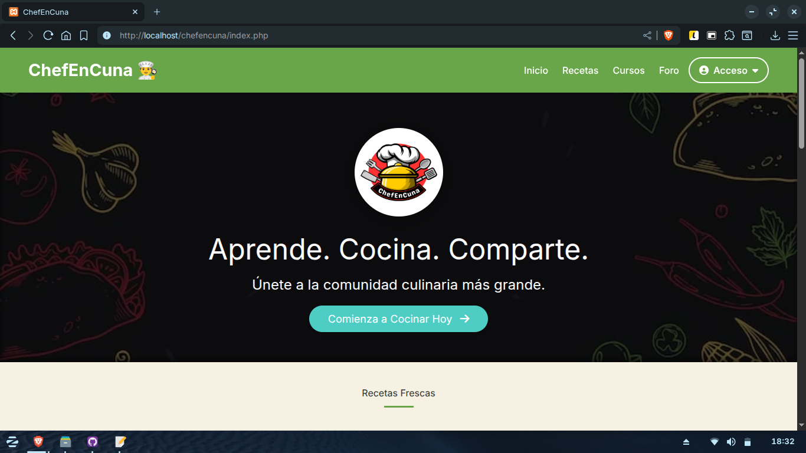
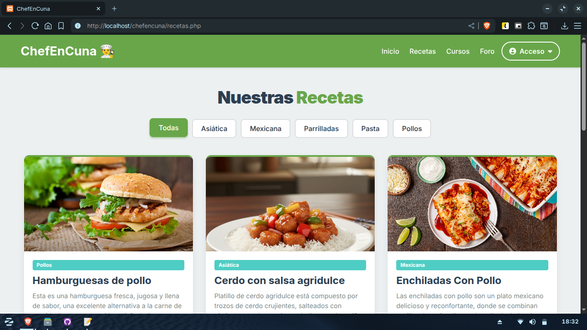
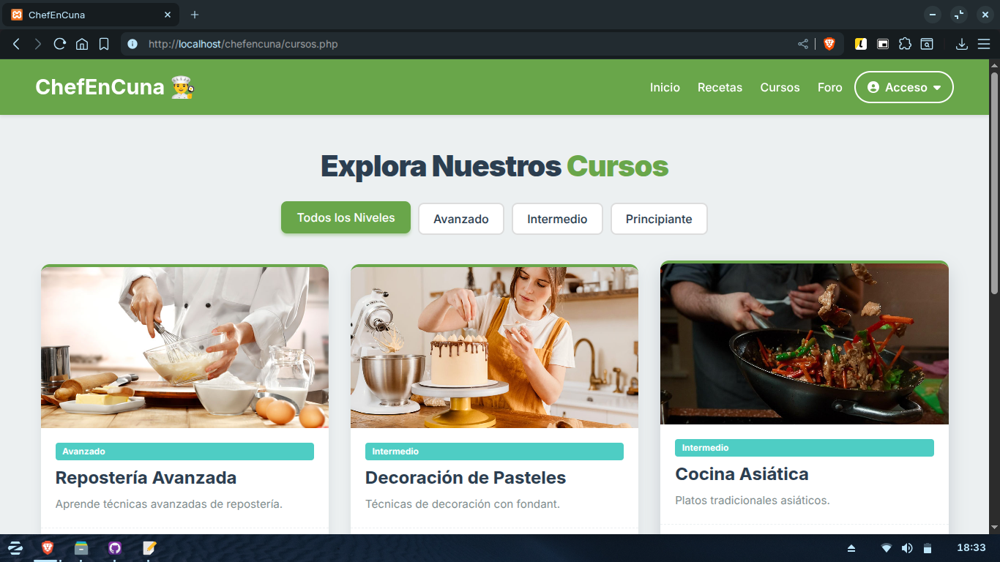

# 👨‍🍳 ChefEnCuna

Plataforma de Gestión de Cursos y Recetas Culinarias

## Descripción

ChefEnCuna es una plataforma de e-learning centrada en la cocina, diseñada para gestionar contenido, usuarios y la comunidad. El sistema permite a los administradores:

Administrar Cursos (módulos y lecciones).
Revisar y publicar Recetas de usuarios y maestros.
Gestionar Usuarios (roles: administrador, maestro, usuario).
Moderar el Foro y las Preguntas Frecuentes (FAQs).

Tecnologías Clave: PHP (Backend), MySQL (BD), Tailwind CSS (Estilos) y Alpine.js (Interactividad).

## Instrucciones de Uso
Para poner a funcionar ChefEnCuna:

Clonación: Clona este repositorio en el directorio de tu servidor web (ej. htdocs)

Base de Datos (BD): Crea una base de datos MySQL llamada chefencuna.

Acceso: Abre tu navegador y navega a la página

## Requisitos

Para poder ejecutar la plataforma en tu servidor local, necesitas:

Entorno Integrado: Un entorno de desarrollo local como XAMPP, WAMP o MAMP, que proporciona el servidor web (Apache) y la base de datos (MySQL).

PHP
Base de Datos: MySQL o MariaDB.

Herramientas de Desarrollo: Un editor de código (ej. VS Code, Sublime Text) para configurar los archivos de conexión y realizar modificaciones.

## Capturas de Pantalla

## Créditos
Este proyecto fue desarrollado utilizando PHP, MySQL y el framework Tailwind CSS.

Autor: 

Alex Mayoral.
